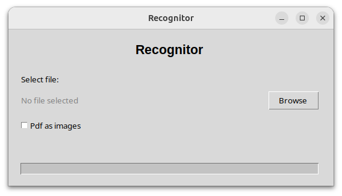

# Recognitor

A simple Python GUI application that converts files to text.

## Features

- **Easy-to-use GUI** - Simple tkinter-based interface
- **Multiple media formats** - Supports MP4, AVI, MOV, MKV, MP3, WAV, OGG.
- **Portable Document Format** - Supports pdf tables, text and images.
- **Image formats** - Supports JPG, JPEG, PNG, BMP.
- **Real-time progress tracking** - Visual progress bar with status updates
- **Automatic file management** - Saves text files in the same directory as source video
- **Cross-platform compatibility** - Works on Windows, macOS, and Linux

## Screenshots



## Requirements

- Python 3.12+
- vosk model (for offline speech recognition)

## Installation

1. **Clone the repository:**
```bash
git clone https://github.com/waldesem/pdf-to-xlsx
cd Video-in-Speech
```

2. **Install required dependencies:**
```bash
pip install -r requirements.txt
```

3. **Install Vosk models (for offline recognition):**
```bash
wget https://alphacephei.com/vosk/models/vosk-model-ru-0.42.zip
unzip vosk-model-ru-0.42.zip
mv vosk-model-ru-0.42 model

## Usage

### GUI Application

1. **Run the application:**
```bash
python mit.py
```

2. **Convert video to text:**
   - Click "Browse" to select a file
   - Click "Convert to Text"
   - Wait for the conversion to complete
   - Click "Open Folder" to view the generated text file

### Building Executable
You can create a standalone executable using PyInstaller that includes all dependencies and models.
```bash
pyinstaller --windowed --add-data="model:model" main.py
```

## License

This project is licensed under the MIT License.